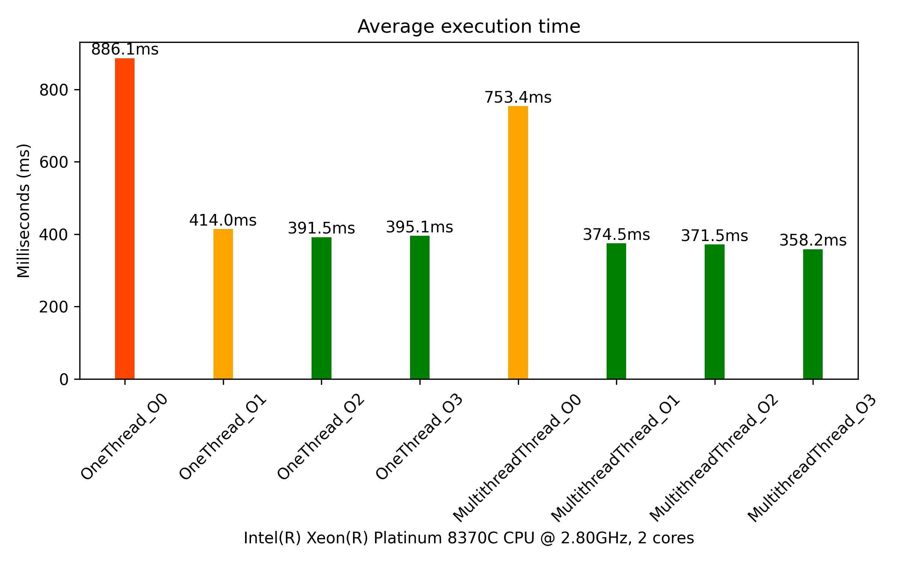
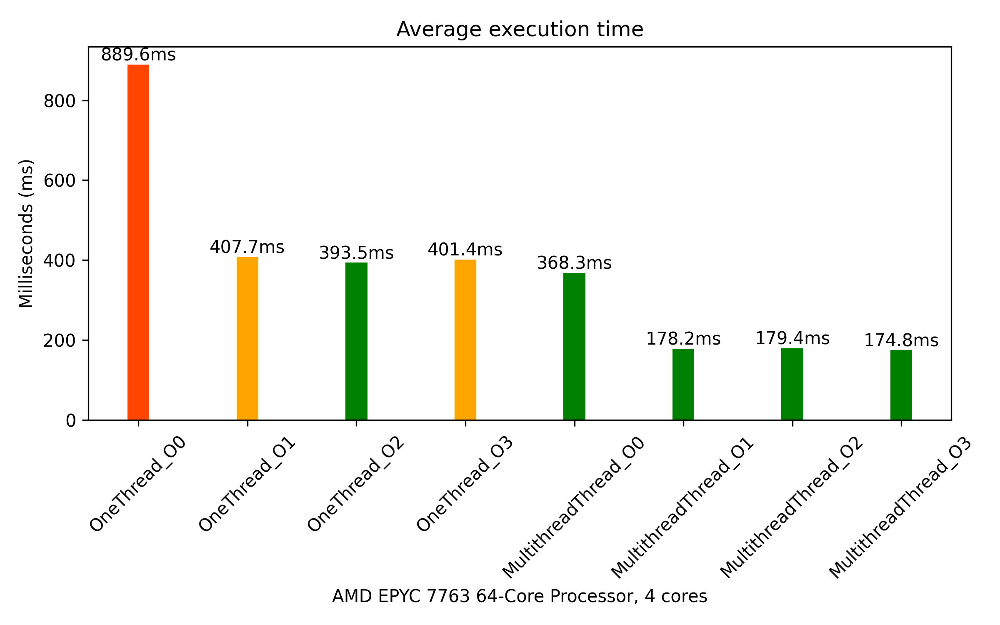

# Polygon-Color-Filler

## Task:
Ви маєте два зображення однакового розміру. На одному з них є білі полігони, які розділені чорною кривою. Якщо візуально накласти полігони на кольорове зображення, всередині кожного полігону буде різна кількість пікселів кожного кольору. Вам потрібно зафарбувати кожен білий полігон кольором, який найчастіше зустрічається всередині цього полігону.

Ось кілька критеріїв для виконання завдання:

1) Всі білі полігони мають бути зафарбовані.
2) Колір для фарбування обирається на основі того, який колір найчастіше зустрічається всередині кожного полігону.
3) Програма повинна працювати якнайшвидше.
4) Швидкість роботи програми має бути заміряна без урахування часу на зчитування та запис зображення.
5) Результат повинен бути збережений у вигляді зображення.

Мова програмування C++11/17.
Можна використовувати будь-які бібліотеки.

## Result:
Результати виконання програми на поточному процесорі наведені нижче.
Виконання проводилося для різних рівнів оптимізації компіляції (O0–O3), а також у одно- та багатопоточному режимі.
Програма виконувала кожне завдання по 100 разів, і для статистики наведено середній час виконання задачі.

### Для 2-х ядерного процессора


### Для 4-х ядерного процессора


## Aditional information:
Для вимірювань використовувався власноруч реалізований профайлер.
Заміри проводилися після завантаження двох зображень (кольорового та маски) і до збереження результуючого зображення у систему.

---
```mergeFiles.cpp``` - Створює виконуваний файл, який накладає маску на кольорове зображення.<br>
```
g++ mergeFiles.cpp -O0 -o ./build/app  `pkg-config --cflags --libs opencv4`

//Usage: app [path/to/folder]
app ./data/100x100/
```
**Результат виконання** - файл ```[path/to/folder]/_combined.png```, який об’єднує файли ```color_mask.png``` та ```mask.png``` з папки ```[path/to/folder]```.


---
```main.cpp``` - Створює виконуваний файл, який заповнює маску найчастішим кольором в сегменті.<br>
```
g++ main.cpp -O0 -o ./build/app  `pkg-config --cflags --libs opencv4`
//Usage: app [path/to/folder]
app ./data/100x100/
```
**Результат виконання** - файл  ```[path/to/folder]/_result.png``` який є результатом основного завдання — заповнення файлу ```mask.png``` ннайчастішим кольором сегменту з ```color_mask.png```.

---
```mainMultithread.cpp``` - Аналогічно ```main.cpp```, але виконує обробку в декількох потоках.


---
```build.sh``` - Запускає збірку додатку, виконує сам додаток, а також скрипт для створення статистики.  
Кількість тестових запусків додатку під різні збірки залежить від змінної ```count``` у цьому скрипті.

---
`buildHistogram.py` - Будує графік `execution_time.png` на основі даних із файлу `result.txt`, `result.txt` створюється та заповнюється під час виконання `build.sh`.

---
Директорія `data` містить як тестові, так і основні дані для виконання задачі.
